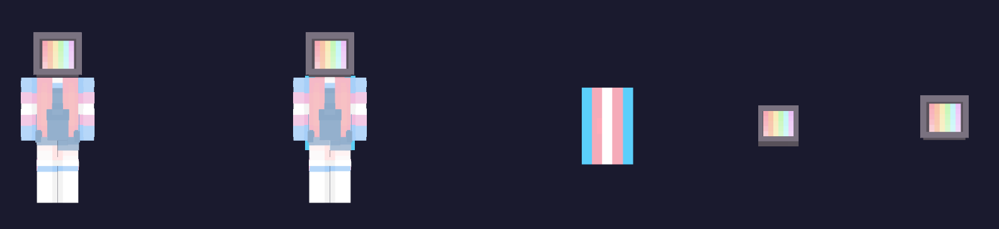
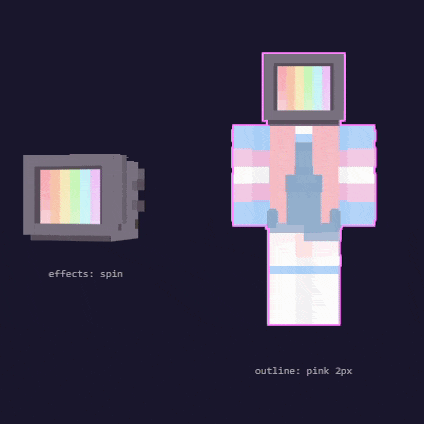
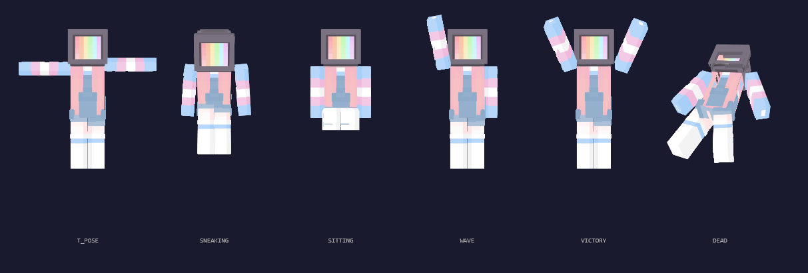

# css-minecraft-skin-viewer

[](https://www.npmjs.com/package/css-minecraft-skin-viewer)
[](https://www.npmjs.com/package/css-minecraft-skin-viewer)
[](./LICENSE)
[](https://github.com/TheNolle/css-minecraft-skin-viewer)

A pure CSS 3D Minecraft skin viewer for React. Supports poses, animations, effects, outline, skull, cape, and face views. SSR-compatible. Zero runtime dependencies.

> Based on the original work of [@rkkoszewski](https://github.com/rkkoszewski/minecraft-css-3d-skin-viewer) — updated, extended, and maintained by [Nolly](https://thenolle.com).



---

## Table of Contents

- [css-minecraft-skin-viewer](#css-minecraft-skin-viewer)
  - [Table of Contents](#table-of-contents)
  - [Installation](#installation)
  - [Quick Start](#quick-start)
  - [Viewer Types](#viewer-types)
  - [Props](#props)
  - [Zoom](#zoom)
  - [Effects](#effects)
  - [Outline](#outline)
  - [Poses](#poses)
    - [Built-in Poses](#built-in-poses)
    - [Extending a Pose](#extending-a-pose)
  - [Animations](#animations)
    - [Built-in Animations](#built-in-animations)
  - [Custom Poses](#custom-poses)
  - [Custom Animations](#custom-animations)
  - [Multiple Viewers on the Same Page](#multiple-viewers-on-the-same-page)
  - [SSR Compatibility](#ssr-compatibility)
  - [License](#license)

---

## Installation

```bash
# npm
npm install css-minecraft-skin-viewer

# pnpm
pnpm add css-minecraft-skin-viewer

# yarn
yarn add css-minecraft-skin-viewer
```

Then import the stylesheet **once** in your app (e.g. `_app.tsx`, `layout.tsx`, or your root component):

```ts
import 'css-minecraft-skin-viewer/style.css'
```

---

## Quick Start

```tsx
import { MinecraftSkinViewer } from 'css-minecraft-skin-viewer'
import 'css-minecraft-skin-viewer/style.css'

export default function App() {
  return (
    <MinecraftSkinViewer
      skinUrl='https://your-cdn.com/skin.png'
      type='player'
      zoom='9x'
    />
  )
}
```

---

## Viewer Types

There are 5 viewer types, controlled by the `type` prop:

| Type | Description |
|---|---|
| `player` | Full 3D player body (default) |
| `player-cape` | Full 3D player body with a cape |
| `cape` | Cape only |
| `face` | Flat 2D face portrait with hat layer |
| `skull` | 3D head only — supports spin, poses, animations |

```tsx
// Full player
<MinecraftSkinViewer skinUrl='...' type='player' />

// Player with cape
<MinecraftSkinViewer skinUrl='...' capeUrl='...' type='player-cape' />

// Cape only
<MinecraftSkinViewer capeUrl='...' type='cape' />

// 2D face
<MinecraftSkinViewer skinUrl='...' type='face' />

// Skull (3D head only)
<MinecraftSkinViewer skinUrl='...' type='skull' />
```

---

## Props

| Prop | Type | Default | Description |
|---|---|---|---|
| `skinUrl` | `string` | — | URL of the skin texture (64×64 or 64×32 PNG) |
| `capeUrl` | `string` | — | URL of the cape texture |
| `type` | `ViewerType` | `'player'` | Which viewer to render (see [Viewer Types](#viewer-types)) |
| `zoom` | `ZoomLevel` | `'9x'` | Scale factor from `1x` to `20x` (see [Zoom](#zoom)) |
| `effects` | `Effect[]` | `[]` | CSS animation effects to apply (see [Effects](#effects)) |
| `legacy` | `boolean` | `false` | Use legacy (64×32) skin format |
| `legacyCape` | `boolean` | `false` | Use legacy cape format |
| `slim` | `boolean` | `false` | Use slim (Alex-style) arms |
| `hideAccessories` | `boolean` | `false` | Hide the outer layer (hat, jacket, sleeves, etc.) |
| `outline` | `OutlineOptions` | — | Add a pixel outline around the viewer (see [Outline](#outline)) |
| `pose` | `PoseOptions` | — | Apply a static pose (see [Poses](#poses)) |
| `animation` | `SkinAnimation` | — | Play a keyframe animation (see [Animations](#animations)) |
| `loop` | `boolean` | `false` | Loop the animation |
| `id` | `string` | `'mc-skin-viewer'` | Unique HTML id — **required when rendering multiple viewers on the same page** |
| `style` | `React.CSSProperties` | — | Inline styles on the root element |
| `className` | `string` | — | Extra class names on the root element |

---

## Zoom

Zoom goes from `1x` to `20x`. The base unit is `9x` (72px head). The component handles scaling internally via a `transform: scale()` wrapper — no layout changes needed on your side.

```tsx
<MinecraftSkinViewer skinUrl='...' zoom='11x' />
<MinecraftSkinViewer skinUrl='...' zoom='4x' />  // tiny
<MinecraftSkinViewer skinUrl='...' zoom='20x' /> // giant
```

---

## Effects

Effects are CSS animations applied directly to the viewer. You can combine multiple at once.



| Effect | Description |
|---|---|
| `spin` | Continuously rotates the viewer on the Y axis |
| `wind` | Cape gently sways as if in wind |
| `walking` | Loops a walk cycle animation |

```tsx
<MinecraftSkinViewer skinUrl='...' effects={['spin']} />
<MinecraftSkinViewer skinUrl='...' effects={['spin', 'wind']} />
```

---

## Outline

Add a pixel-perfect outline drop shadow around the entire viewer using the `outline` prop.

```tsx
<MinecraftSkinViewer
  skinUrl='...'
  outline={{ color: '#000000', thickness: 1 }}
/>
```

| Option | Type | Default | Description |
|---|---|---|---|
| `color` | `string` | `'#000000'` | Any valid CSS color |
| `thickness` | `number` | `1` | Thickness in pixels |

---

## Poses

Poses apply a static transform to one or more body parts. Use the built-in `POSES` presets or write your own.



### Built-in Poses

```tsx
import { MinecraftSkinViewer, POSES } from 'css-minecraft-skin-viewer'

<MinecraftSkinViewer skinUrl='...' pose={POSES.IDLE} />
<MinecraftSkinViewer skinUrl='...' pose={POSES.SNEAKING} />
```

| Pose | Description |
|---|---|
| `T_POSE` | Arms fully extended sideways |
| `IDLE` | Slight arm sway at rest |
| `WALKING` | Mid-step walking stance |
| `RUNNING` | Leaning forward, arms and legs at full stride |
| `SNEAKING` | Crouched with bent knees |
| `SITTING` | Legs bent at 90°, sitting position |
| `SLEEPING` | Entire body rotated flat |
| `WAVE` | Left arm raised in a wave |
| `VICTORY` | Both arms raised in triumph |
| `LOOK_UP` | Head tilted up |
| `LOOK_DOWN` | Head tilted down |
| `ATTACK` | Striking pose with raised arm |
| `OFFER` | Both arms extended forward |
| `DEAD` | Fallen body with tilted corpse |

### Extending a Pose

```tsx
// Start from a preset and override one part
<MinecraftSkinViewer
  skinUrl='...'
  pose={{ ...POSES.IDLE, leftArm: { x: 45 } }}
/>
```

---

## Animations

Animations play keyframe sequences across body parts. Use the built-in `ANIMATIONS` presets or define your own.

### Built-in Animations

```tsx
import { MinecraftSkinViewer, ANIMATIONS } from 'css-minecraft-skin-viewer'

// Loop the walk cycle
<MinecraftSkinViewer skinUrl='...' animation={ANIMATIONS.WALK} loop />

// Play a back flip once
<MinecraftSkinViewer skinUrl='...' animation={ANIMATIONS.BACK_FLIP} />
```

| Animation | Description |
|---|---|
| `WALK` | Smooth looping walk cycle |
| `RUN` | Fast running cycle with body lean |
| `FRONT_FLIP` | Full forward somersault |
| `BACK_FLIP` | Full backward somersault |

> **Note:** When `animation` is set, `pose` is ignored. The two props are mutually exclusive.

---

## Custom Poses

A pose is a `PoseOptions` object. Each body part accepts a `PartTransform`:

```ts
interface PartTransform {
  x?: number   // rotateX in degrees
  y?: number   // rotateY in degrees
  z?: number   // rotateZ in degrees
  tx?: number  // translateX in px
  ty?: number  // translateY in px
  tz?: number  // translateZ in px
}

interface PoseOptions {
  corpse?:   PartTransform  // rotates the entire player
  head?:     PartTransform
  body?:     PartTransform
  leftArm?:  PartTransform
  rightArm?: PartTransform
  leftLeg?:  PartTransform
  rightLeg?: PartTransform
}
```

```tsx
<MinecraftSkinViewer
  skinUrl='...'
  pose={{
    head: { y: 30 },
    leftArm: { x: -90, z: 10 },
    rightArm: { x: -90, z: -10 },
  }}
/>
```

---

## Custom Animations

An animation is an array of `AnimationFrame` objects:

```ts
interface AnimationFrame {
  pose: PoseOptions         // target pose for this frame
  duration: number          // duration of this frame in ms
  interpolate?: boolean     // smoothly interpolate to the next frame
  resetToOrigin?: boolean   // smoothly return to the default pose
}
```

```tsx
import { MinecraftSkinViewer } from 'css-minecraft-skin-viewer'

const nod = [
  { pose: { head: { x: 20 } }, duration: 200, interpolate: true },
  { pose: { head: { x: -20 } }, duration: 200, interpolate: true },
  { pose: { head: { x: 0 } }, duration: 200, resetToOrigin: true },
]

<MinecraftSkinViewer skinUrl='...' animation={nod} loop />
```

**Tips:**
- `interpolate: true` creates a smooth transition between the current frame and the next
- `resetToOrigin: true` interpolates back to the neutral pose — useful as a final frame before looping
- `loop` repeats the full animation indefinitely
- Omitting `loop` plays the animation exactly once and holds the last frame

---

## Multiple Viewers on the Same Page

Each viewer injects scoped CSS using its `id`. When rendering more than one viewer, always provide a unique `id` per instance:

```tsx
<MinecraftSkinViewer id='viewer-steve' skinUrl={steveUrl} />
<MinecraftSkinViewer id='viewer-alex' skinUrl={alexUrl} slim />
<MinecraftSkinViewer id='viewer-skull' skinUrl={steveUrl} type='skull' effects={['spin']} />
```

---

## SSR Compatibility

This component is fully SSR-compatible (Next.js App Router, Pages Router, Remix, etc.). It produces no `window` or `document` references during render. The CSS is loaded via a standard stylesheet import — no runtime injection.

```ts
// app/layout.tsx (Next.js App Router)
import 'css-minecraft-skin-viewer/style.css'
```

---

## License

MIT © [Nolly](https://thenolle.com)

Based on the original CSS skin viewer by [@rkkoszewski](https://github.com/rkkoszewski/minecraft-css-3d-skin-viewer).

> Protect the dolls 🏳️‍⚧️